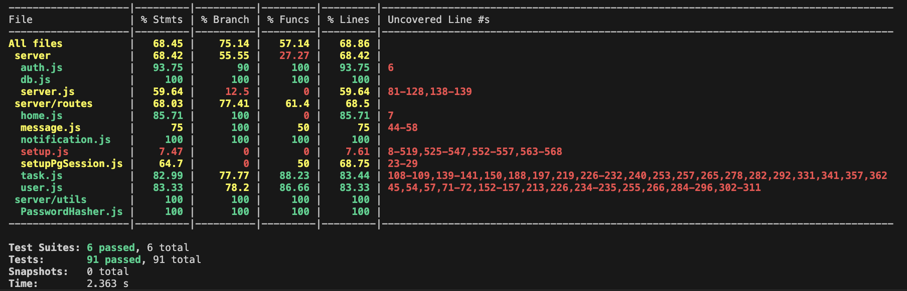

# NodeNinjas

## Stack used: PERN (PostgreSQL, Express, React, Node.js)

### Build tool for React: Vite.js, most common libraries used: TailwindCSS, shadcn/ui, socket.io (for real-time messaging)

## Current status of the project:

- All functional requirements met (99%)

- All non-functional requirements met (99%)

- All technical requirements met (99%)

- 5% from each requirements are to be met in the future, we are covering minor edge cases, bug fixes (visual/backend) and code refactoring.

## Known Bugs

### Typing UI is not displaying when a user types on the Chat feature.

The typing indicator UI is not displaying when a user begins typing in the chat input field The issue was observed while testing commit [#232](https://github.com/rinmeng/NodeNinjas/pull/232). Normally when a user types, the UI should show a typing indicator to signal activity, but currently there is no visual feedback. This affects the features of frontend components, specifically the typing status handling. The absence of the indicator can impact user experience. The issue is considered moderate in severity, as it does not block functionally but affects usability.

### Register feature isn’t working when a team member submits the registration form.

The register feature is currently broken for team members when they submit the registration form. After completing the form and clicking the submit button, no registration is processed, and the user remains on the same page. This but was observed while testing commit [#246](https://github.com/rinmeng/NodeNinjas/pull/246). It affects the registration form, team member onboarding flow and backend API handling the registration process Given that this issue prevents new team members from creating accounts and accessing the platform, it is classified as critical in severity.

### When you have all read notifications, if you toggle them to unread they will be listed at the bottom instead of going to the top

When all notifications are marked as read, toggling any of them back to unread causes them to appear at the bottom of the list instead of moving to the top, as expected This breaks the intended sorting behaviour where unread notifications should be prioritized and displayed first. The issue was observed while testing commit [#183](https://github.com/rinmeng/NodeNinjas/pull/183). It affects the notification component, specifically the logic responsible for sorting and rendering unread vs. read states. While this does not block core functionality, it leads to a confusing user experience and may cause important unread items to be overlooked. This issue is considered moderate severity. Solved with PR: [#248](https://github.com/rinmeng/NodeNinjas/pull/248)

### Admin’s with newly registered users in their team don't have user and task data displayed in Admin Page.

Data of newly registered team-members under newly registered admins aren’t displayed on the graphs for the Admin Page when the newly registered admin is logged in. This results in a confusing or empty view with no actionable content. The issue was identified while testing commit [#164](https://github.com/rinmeng/NodeNinjas/pull/164). It affects the admin access control logic and the rendering conditions for the Admin Page. Since this can lead to unnecessary UI exposure and may confuse users who shouldn't see the page, the severity of this issue is low to moderate. Solved with PR: [#247](https://github.com/rinmeng/NodeNinjas/pull/247)

## How to login?

- You can login using the following credentials:

  - Username & Password: `rin`

  - To test the real-time messaging feature, you can login using the following credentials (in a different browser eg, one on google chrome, one on edge, or incognito mode):

    - Username & Password: `arnold`

## How to run the project?

- Visit the [tutorial](tutorial.md) for more information.

- Or pull the [Docker Image](https://hub.docker.com/r/rinmeng/nodeninjas-ctms/tags) from Docker Hub and run it locally with the [`docker-compose.yml`](./ctms/docker-compose.yml) file.

## Test Coverage

### Note that we can't really test the socket.io functionality, so we are not testing the real-time messaging feature, also setup.js is not being tested because that is the beggining of the app and we are not testing the beginning of the app, we are testing the functionality of the app.

### Test Coverage Report Summary

Statements: 81.79%

Branches: 83.99%

Functions: 100%

Lines: 82.09%

Test Suites: 6 passed, 6 total

Tests: 91 passed, 91 total
